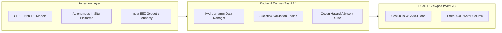

# SamudraDrishti
### National 3D Ocean Digital Twin & In-Situ Observation Platform

[](https://nextjs.org/)
[](https://react.dev/)
[](https://cesium.com/)
[](https://threejs.org/)
[](https://fastapi.tiangolo.com/)
[](https://tailwindcss.com/)
[](https://cfconventions.org/)
[](https://en.wikipedia.org/wiki/World_Geodetic_System)

---

## 🌊 Overview

**SamudraDrishti** is a state-of-the-art, web-based **3D Ocean Digital Twin and Decision-Support Platform**. It simultaneously co-visualizes high-resolution numerical ocean circulation models with real-time autonomous in-situ observation instruments across the North Indian Ocean (Arabian Sea, Bay of Bengal, and Equatorial Indian Ocean).

Designed for operational oceanographers, marine safety coordinators, and researchers, SamudraDrishti bridges the gap between numerical simulation fields (CF-1.8 NetCDF) and autonomous physical observations (Argo floats, underwater gliders, moored OMNI buoys).



---

## ✨ Key Capabilities

### 1. 🌐 Dual-Engine 3D Oceanography
- **Cesium.js WGS84 Planetary Geosphere**: A macro-scale 3D ellipsoidal Earth displaying high-resolution CartoDB satellite basemaps, glowing 3D Indian Exclusive Economic Zone (EEZ) boundaries (2.37 million $\text{km}^2$), autonomous fleet markers, and surface-draped numerical scalar fields.
- **Three.js 4D Sub-Surface Water Column**: A high-density micro-scale volumetric slicer supporting continuous depth slicing ($0 - 2000\,\text{m}$), $1\times - 35\times$ vertical exaggeration, animated particle current streamlines, and 3D great-circle vertical transect curtains.

### 2. 📡 Real-Time Autonomous Fleet Co-Visualization
- **Multi-Platform Integration**: Co-renders 14 live autonomous platforms (8 Argo profiling floats, 3 underwater gliders, 3 moored OMNI/RAMA buoys).
- **Slide-Out Telemetry Drawer**: Non-blocking inspection of continuous vertical depth soundings (Temperature, Salinity, Chlorophyll-a).
- **Point-to-Point Statistical Scoring**: Computes real-time oceanographic validation scorecards comparing model predictions against in-situ observations (RMSE, Mean Bias, Pearson correlation $r$, Willmott index $d$).

### 3. 🚨 Operational Marine Hazard Advisories
- **Tropical Cyclone Heat Potential (TCHP)**: Integrates upper-ocean thermal energy from the surface down to the $26^\circ\text{C}$ isotherm ($D_{26}$). Areas exceeding $80\,\text{kJ/cm}^2$ are flagged for cyclone rapid intensification risk.
- **Potential Fishing Zones (PFZ)**: Spatial thermal gradient front detection identifying nutrient-rich coastal upwelling zones for pelagic fisheries.
- **Marine Heatwave (MHW) Monitoring**: Automated thermal stress detection tracking sea surface temperature anomalies ($\Delta T \ge 1.5^\circ\text{C}$).
- **Search & Rescue (SAR) Maritime Drift**: 48-hour forward leeway drift trajectory simulation incorporating surface hydrodynamic currents and wind forcing.

### 4. 📐 3D Vertical Ocean Transect Curtains
- Interactive arbitrary transect tool generating great-circle vertical curtains across critical maritime channels (e.g., Chennai–Port Blair, Palk Strait, Mumbai Offshore) to analyze internal thermocline gradients and acoustic sound speed channels.

### 5. 📂 Automated Multi-Format Ingestion
- Ingests standard CF-compliant NetCDF-4 (`.nc`, `.nc4`) model grids with automatic coordinate detection (`lat`, `lon`, `depth`, `time`) alongside raw WMO ASCII/CSV observational feeds.

---

## 🏛️ Professional Institutional Design System

SamudraDrishti features a clean, high-density scientific workstation aesthetic modeled after international oceanographic centers (NOAA, ECMWF, Mercator Ocean):
- **White Mode / Light Theme**: Pure `#ffffff` cards and panels with soft `#f8fafc` slate canvas for optimal daylight readability.
- **WCAG AAA Contrast**: Deep navy (`#0f172a`) and slate typography ensuring clarity.
- **Authoritative Palette**: Deep maritime blue (`#005a9c`) for primary actions and layer states.
- **National Navigation Crest**: Custom vector emblem combining an 8-point faceted compass star, bathymetric isobaths, azimuth dial, and acoustic telemetry beacon.

---

## 🚀 Quickstart Guide

### Prerequisites
- **Python 3.10+**
- **Node.js 20+** & **npm 10+**
- Modern WebGL2-enabled web browser (Chrome, Edge, Firefox, Safari)

### 1. Installation

```bash
# Clone the repository
git clone https://github.com/Agam348/SamudraDrishti.git
cd SamudraDrishti

# Setup Python backend environment
python -m venv venv
# On Windows:
venv\Scripts\activate
# On Linux/macOS:
source venv/bin/activate
pip install -r server/requirements.txt

# Generate initial ocean model & fleet data (if needed)
python server/generate_sample_data.py

# Setup Next.js frontend
cd client
npm install
cd ..
```

### 2. Launching the System

```bash
# Unified Launch (starts FastAPI on port 8000 and Next.js on port 3000):
python run.py
```

Or launch services independently:

```bash
# Terminal 1 — FastAPI Numerical Engine:
python -m uvicorn server.main:app --host 0.0.0.0 --port 8000

# Terminal 2 — Next.js Production Client:
cd client
npm run build
npm run start -- -p 3000
```

Access the portal:
- **Interactive 3D Portal**: [http://localhost:3000](http://localhost:3000)
- **FastAPI OpenAPI Swagger UI**: [http://localhost:8000/docs](http://localhost:8000/docs)

---

## 🌐 Production Deployment

### Option A: Hybrid Cloud (Recommended & Free Tier Ready)

1. **Deploy Backend (FastAPI Engine)**:
   - **Render**: Import this repository on [Render](https://render.com). It automatically detects `render.yaml` and launches the backend Docker container at `https://<your-backend>.onrender.com`.
   - **Railway**: Connect this repo on [Railway](https://railway.app). It automatically builds the root `Dockerfile` and deploys.
   - Test your deployment: visit `https://<your-backend-url>/api/health` to confirm `{"status": "healthy"}`.

2. **Deploy Frontend (Next.js)** on **Vercel**:
   - Import this repository on [Vercel](https://vercel.com).
   - Set **Root Directory** to `client`.
   - In **Environment Variables**, add:
     - `BACKEND_URL` = `https://<your-backend-url>` (e.g., `https://samudradrishti-backend.onrender.com`)
   - Click **Deploy**. Vercel will build the frontend and proxy all `/api/...` and `/docs` requests to your backend without CORS issues.

### Option B: Full-Stack Docker Compose (Self-Hosted / VPS)

```bash
docker compose up -d --build
```
- Frontend: `http://localhost:3000`
- Backend API: `http://localhost:8000`
- Swagger UI: `http://localhost:8000/docs`

---

## 📋 Technology Stack

| Layer | Technology | Purpose |
| :--- | :--- | :--- |
| **Frontend Framework** | [Next.js 16 (App Router)](https://nextjs.org/) | Server-side rendering, routing, static optimization |
| **UI Library** | [React 19](https://react.dev/) | Component architecture, hooks, state management |
| **Styling** | [Tailwind CSS v4](https://tailwindcss.com/) | Institutional light theme styling, utility layout |
| **Planetary 3D Engine** | [CesiumJS 1.120](https://cesium.com/) | WGS84 ellipsoidal globe, satellite basemaps, EEZ draping |
| **Volumetric 3D Engine**| [Three.js r185](https://threejs.org/) | 4D sub-surface water column, continuous slicing, streamlines |
| **Charting** | [Recharts](https://recharts.org/) | SVG in-situ depth profiles, validation curves |
| **Backend Framework** | [FastAPI](https://fastapi.tiangolo.com/) | High-performance asynchronous REST API |
| **Numerical Processing**| [xarray](https://docs.xarray.dev/) & [netCDF4](https://unidata.github.io/netcdf4-python/) | Multi-dimensional grid slicing, CF coordinate parsing |
| **Scientific Computing**| [NumPy](https://numpy.org/) & [SciPy](https://scipy.org/) | Spline interpolation, TCHP integration, gradient filters |

---

## 📄 License & Attribution

This project is distributed under the Apache-2.0 License.  
All oceanographic coordinate grids strictly reference the WGS84 geodetic datum.  

© 2026 SamudraDrishti Oceanographic Intelligence Platform. All Rights Reserved.
